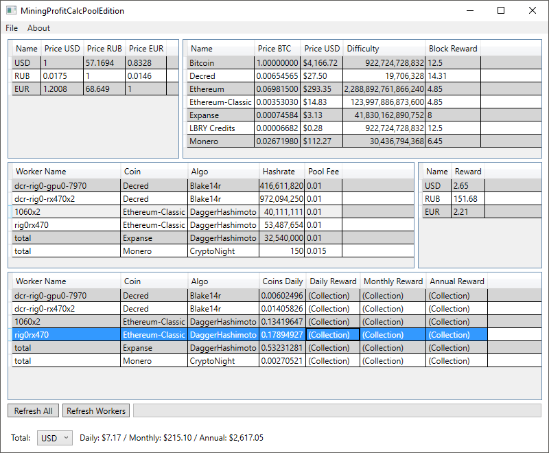

# MiningProfitCalcPoolEdition



Mining Profitability Calculator

Mining profitability calculator that loads all required data from pools directly.

No more need to enter your stats manually.

Set up your pools once — check profitability any time.

### Requirements

 [Microsoft .NET Framework 4.5.2](https://www.microsoft.com/en-us/download/details.aspx?id=42642)
 
 [Microsoft Visual C++ Redistributable Packages](https://support.microsoft.com/en-us/help/2977003/the-latest-supported-visual-c-downloads)
 
 [Newtonsoft Json.NET](https://www.newtonsoft.com/json)

### Supported pools/coins:

* EtherMine.org — Ethereum;
* EtherMine.org — Ethereum-Classic;
* *DwarfPool.com — Expanse;
* *DwarfPool.com — Monero;
* CoinMine.pl — Decred;
* CoinMine.pl — LBRY Credits;
* NanoPool.org — Monero;
* NanoPool.org — Ethereum-Classic;
* SuprNova.cc — Decred.

(*) Limited support due to pool's API.

Most pools require wallet address to get your data.

Pools using MPOS engine (like CoinMine.pl, SuprNova.cc) require API key instead.

### UI
#### Menu Items

File -> Add Worker — add worker via UI;

File -> Load from JSON — load workers from JSON-file;

File -> Save to JSON — save workers list to JSON-file.


#### Buttons

Refresh All — refresh all data sources;

Refresh Workers — keep crypto and fiat currencies data, refresh pools data only.

### Misc

If 'workers.json' exists in the same directory as main .exe, it's loaded automatically at app's startup.

JSON-file format example:
```json
[
  {
    "poolName": "EtherMine.org",
    "currency": "Ethereum",
    "algo": "DaggerHashimoto",
    "wallet": "",
  },
  {
    "poolName": "DwarfPool.com",
    "currency": "Expanse",
    "algo": "DaggerHashimoto",
    "wallet": "",
  },
  {
    "poolName": "DwarfPool.com",
    "currency": "Monero",
    "algo": "CryptoNight",
    "wallet": "",
  },
  {
    "poolName": "CoinMine.pl",
    "currency": "Decred",
    "algo": "Blake14r",
    "apikey": "",
  }
]
```
